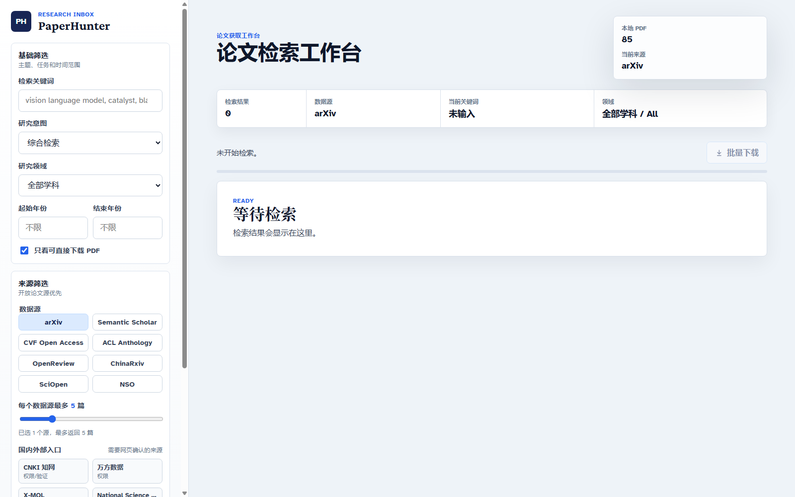

<div align="center">
  <h1>PaperHunter</h1>
  <p><strong>A local research paper discovery and PDF download workspace for researchers.</strong></p>
  <p>
    English · <a href="README.zh-CN.md">简体中文</a>
  </p>
  <p>
    <a href="LICENSE"></a>
    <a href="https://github.com/Jia0808/PaperHunter/actions/workflows/ci.yml"></a>
    
    
  </p>
</div>



## Why PaperHunter

PaperHunter helps researchers search across multiple open paper sources, filter results with research-oriented controls, and download public open-access PDFs into a local folder. It is designed as a practical literature discovery tool rather than a crawler that bypasses access controls.

The project uses a plain Python backend and a native HTML/CSS/JavaScript frontend. It does not require a database, account system, or cloud service.

## Highlights

- Multi-source search across international and domestic open sources.
- Research-friendly filters for intent, field, year range, author, venue, match scope, arXiv category, and downloadable-only results.
- Per-source result limits, so one large source does not dominate the list.
- Local PDF download with duplicate detection.
- External gateway buttons for Google Scholar, CNKI, Wanfang, X-MOL, Nature, Science, and other sources that usually require login, institutional permission, payment, robots.txt restrictions, or CAPTCHA.
- Local-first workflow: downloaded PDFs stay under `downloaded_papers/`, which is ignored by Git.
- Lightweight stack: Python 3.12, `requests`, `arxiv`, and browser-native frontend code.

## Supported Sources

| Source | Search | PDF Download | Notes |
| --- | --- | --- | --- |
| arXiv | Yes | Yes | Uses the arXiv package/API. |
| Semantic Scholar | Yes | Public open PDFs only | Subject to Semantic Scholar rate limits. |
| CVF Open Access | Yes | Yes | Searches public CVF Open Access pages. |
| ACL Anthology | Yes | Yes | Uses ACL Anthology metadata/cache. |
| OpenReview | Yes | Public open PDFs only | Some PDFs may require validation by the host. |
| ChinaRxiv / ChinaXiv | Yes | Public open PDFs only | Domestic open paper source. |
| SciOpen | Yes | Public open PDFs only | Domestic/open-access source. |
| National Science Open | Yes | Public open PDFs only | Open journal source. |
| Google Scholar, CNKI, Wanfang, X-MOL, Nature, Science | External gateway only | No automated download | These sources may require manual browsing, login, authorization, payment, robots.txt compliance, or human verification. |

## Quick Start

Python 3.12 or newer is recommended.

```bash
python -m venv venv
venv\Scripts\activate
pip install -r requirements.txt
python app.py
```

Then open:

```text
http://127.0.0.1:8000
```

On Windows, you can also run:

```bat
start_paperhunter.bat
```

## Typical Workflow

1. Enter a research keyword or phrase.
2. Select research intent, field, year range, source group, and per-source limit.
3. Run the search and review metadata, venues, years, and PDF availability.
4. Download selected open-access PDFs or batch-download downloadable results.
5. Use external gateway buttons when a source needs browser-side login or institution access.

## Project Structure

```text
app.py                    Python HTTP server, source adapters, filters, downloads
web/index.html            Browser UI structure
web/styles.css            UI styling
web/app.js                Frontend state, filters, API calls
downloaded_papers/        Local PDF output directory, ignored by Git
docs/assets/              README and documentation images
.github/workflows/ci.yml  Syntax checks for Python and JavaScript
```

## Development Checks

```bash
python -m py_compile app.py
node --check web/app.js
```

## Compliance

PaperHunter only attempts automated downloads from open PDF URLs or public open-access endpoints. It does not bypass paywalls, authentication, CAPTCHA, institutional access controls, or publisher restrictions.

Sources such as Google Scholar, CNKI, Wanfang, X-MOL, Nature, Science, and similar websites may require manual browsing, login, institutional authorization, payment, robots.txt compliance, or human verification. PaperHunter exposes them only as external browser entry points where appropriate.

See [DISCLAIMER.md](DISCLAIMER.md) for details.

## Repository Safety

If you publish this repository on GitHub, review [docs/REPOSITORY_SAFETY.md](docs/REPOSITORY_SAFETY.md). At minimum:

- enable two-factor authentication on the owner account
- protect the `main` branch
- disallow force pushes and branch deletion
- avoid granting collaborator `Admin` permissions unless necessary
- keep a local mirror backup

## Contributing

Issues and pull requests are welcome. Please keep source integrations compliant with each website's terms of service and avoid adding logic that bypasses access restrictions.

See [CONTRIBUTING.md](CONTRIBUTING.md) for the contribution guide and [SECURITY.md](SECURITY.md) for security reporting.

## License

Apache License 2.0. See [LICENSE](LICENSE).
